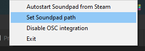
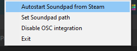
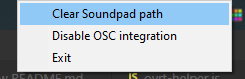
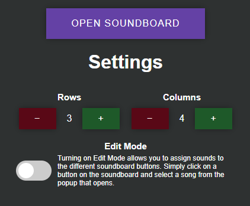
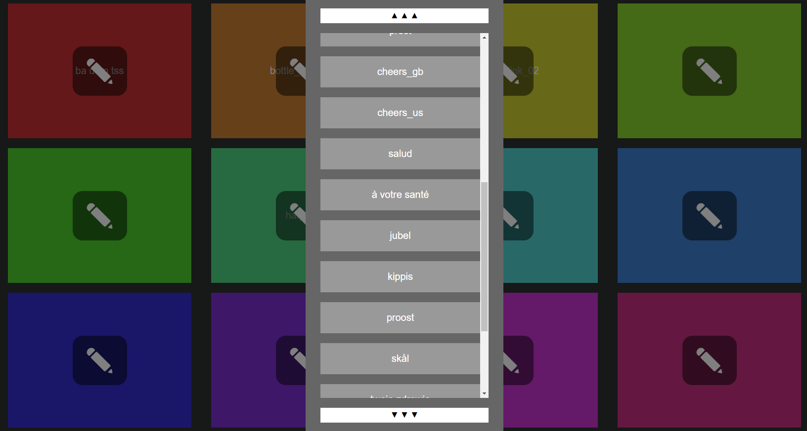

# OVR Toolkit Soundpad Integration
A OVR Toolkit app and a bridge that brings the Soundpad soundboard into OVR Toolkit.
Apps running within OVR Toolkit do not have enough access to the system where they would be able to interact with Soundpad.
For this reason, a bridge app is required, which allows us to access Soundpad from within OVR Toolkit.

**NOTE**: This app requires [Soundpad](https://leppsoft.com/soundpad/en/) to work! It does next to nothing without it. You can buy Soundpad either on the website or [on Steam](https://store.steampowered.com/app/629520/Soundpad/).

## Installation of the bridge

Simply go to the [Releases](https://github.com/jangxx/OVRT_Soundpad/releases) and download the latest version as a zip file.
Extract this file to a directory of your liking and you are done.
Simply execute ovrt_soundpad_bridge.exe in the unpacked directory.

### Updating the bridge

To update the bridge simply delete all files from the previous installation and copy the files from the new version into the same folder.
The settings are kept in a different place, so it's always safe to completely delete the whole installation directory.

## Auto-launch Soundpad with the bridge

If you want to avoid the hassle of always having to start two programs (Soundpad and the bridge), you can instruct the bridge to automatically launch Soundpad if it's not running already, in which case you only have to start the bridge app.

Simply right-click on the tray icon and select _Set Soundpad path_ as shown in the following picture:

You then have to navigate to the directory where Soundpad is installed and select `Soundpad.exe`.

If you use the Steam version, you instead click on _Autostart Soundpad from Steam_:

If you want to disable the auto-launch feature again, simply click on _Clear Soundpad path_ or untick _Autostart Soundpad from Steam_ respectively:

## Usage

### Phone UI

The interface should be self-explanatory.
- Click the big "Open Soundboard" button to open the soundboard overlay
- Use the `+` and `-` buttons to change the dimensions of the soundboard. Items that are cut off will still be saved.
- Turn on the Edit Mode in order to change the effects of the buttons on the soundboard.

### Soundboard UI

The soundboard UI is also very simple:

Clicking on a button will play the sound effect. The names are identical to the ones used within Soundpad itself.

If the Edit Mode is turned on, each of the buttons with get a little edit icon and clicking it will open a list of sound effects from Soundpad to choose from.

## OSC Integration

Version 1.2.0 adds support to interface with the bridge via OSC.
To enable this feature, right click on the tray icon and click on _Enable OSC integration_.
Afterwards restart the bridge for the change to take effect.

By default, the OSC server listens on `127.0.0.1:9001` and offers two addresses:

- `/ovrtsp/PlayBoard i`: Sending a message to this address plays a message from one of the boards. The parameter is an integer in the range 0 - 999 where the rightmost digit is the column, the middle digit is the row and the leftmost digit is the page, all subtracted by 1. For example: If you wanted to play the sound in the 2nd column, 3rd row on the sixth page you would send the parameter `521`.
- `/ovrtsp/PlayIndex i`: This address can be used to play a sound from Soundpad directly, skipping the board altogether. The parameter is an integer that corresponds to the sound index, which you can see by going into Soundpad, clicking on _Window > Categories > All Sounds_ and looking into the first column of the list.

If you want to change the addresses or the address and port the OSC server listens on, you have to open the config file located in _%localappdata%\jangxx\OVRT Soundpad\config.json_ (you can paste this into the File Explorer directly) and edit the respective values under the `"osc"` key.
Don't forget to quit the bridge before editing the file as your changes will be overwritten otherwise.

## Development

This section covers topics related to running and building the app as well as the bridge locally.

### Running the bridge

First install Python 3 so that is accessible from the Terminal.

Step 1: Create a virtualenv (you only have to do this the first time)

	python -m venv venv

Step 2: Activate the virtalenv

- Powershell: `.\venv\Scripts\activate`
- CMD: `.\venv\Scripts\activate.bat`
- Bash: `source venv/Scripts/activate`

Step 3: Install required packages (you only have to do this the first time)

	pip install -r requirements.txt

Step 4: Run the bridge!

	python server/main.py

### Building the bridge exe file

We use cx_Freeze to build a standalone version of the bridge for releases.
Simply run

	python setup.py build

to build the app into the `dist/bridge` directory.

### Developing the OVR Toolkit app

We use `gulp` and `browserify` to build everything that is frontend related.

First install Node.js (and npm) and then run `npm i -g gulp-cli` to install gulp.

Then to tnstall all required packages (you only have to do this the first time):

	npm install

Afterwards you are good to go. Run

	gulp

to spin up a development server (localhost:8080).
You can now use a normal browser to develop the app instead of always having to going into OVR Toolkit.
Obviously, none of the OVR Toolkit specific functionality will work here (like opening the overlay).

Gulp will automatically rebuild and package the whole app every time you change something.
To access the app from within OVR Toolkit create a symlink (folder junction) between `dist/workshop` and a folder within `LocalCustomApps` within the OVR Toolkit installation dir.
For example (your paths will probably differ):

	mklink /J "C:\Program Files (x86)\Steam\steamapps\common\OVR Toolkit\LocalCustomApps\ovrt_soundpad" dist\workshop

OVR Toolkit will now show the app in the phone view.
If you made a change you have to manually reload the page however, either by closing and re-opening the overlay or by going to the CEF debugger (localhost:9849) and clicking on the reload button.